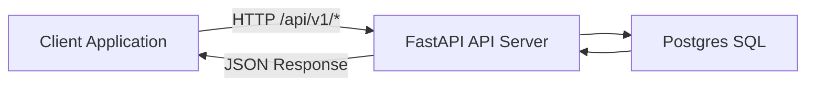

# 🚗 Demo Carwash Backend API

A production-style backend service that simulates and manages the core operations of a carwash business.

This project is designed as a backend engineering showcase, focusing on clean architecture, structured domain modeling, and scalable API design.

---

## 🎯 Project Purpose

This repository demonstrates how to design and implement a real-world operational backend system with:

- Clear separation of concerns
- Use-case driven application flow
- Role-based access control
- Transactional data integrity
- Dockerized development environment

The focus is on backend architecture quality rather than feature quantity.

---

## 🚀 Key Capabilities

- Versioned REST API (`/api/v1`)
- Authentication & role-based access control (Admin / Cashier)
- Ticket lifecycle management (create, list, void)
- Transaction processing & listing
- User management (register, activate, deactivate)
- Service type management
- Async PostgreSQL integration (SQLAlchemy + asyncpg)
- Rate limiting & security middleware
- Docker-based local environment setup

---

## 🏗 Architecture Overview

### Core Services

- `api` → FastAPI HTTP service
- `db` → PostgreSQL database

---

### Request Flow

1. Client sends request to `/api/v1/*`
2. API validates payload and authorization
3. Application use case executes business logic
4. Repository layer handles database interaction
5. Structured JSON response is returned

---

### High-Level Architecture



---

## 🧱 Architectural Principles

The project follows a Clean Architecture-inspired structure:

- `domain`  
  Contains entities, value objects, and business rules.

- `application`  
  Contains use cases and DTO contracts.

- `api`  
  Handles HTTP layer, request validation, and response mapping.

- `infrastructure`  
  Contains database configuration, repository implementations, and external integrations.

Key principles:

- Use-case driven application services
- DTO-based request/response contracts
- Explicit domain entities & value objects
- Repository abstraction for persistence isolation
- Clear transaction boundaries

---

## 🛠 Tech Stack

- Python 3.12
- FastAPI
- PostgreSQL
- SQLAlchemy (Async)
- asyncpg
- Pydantic v2
- slowapi (Rate limiting)
- pytest
- Docker & Docker Compose

---

## 🔐 Engineering Highlights

- Role-protected endpoints (Admin vs Cashier)
- Structured API response wrapper
- Input validation via Pydantic
- Security middleware:
  - CORS
  - Rate limiting
  - Basic security headers
- Atomic transaction handling
- Database health check in Docker Compose

---

## 📂 Project Structure

```
api/
├── dependencies/
├── schema/
└── v1/
application/
├── dto/
└── use_cases/
core/
├── middleware/
└── config.py
domain/
├── entities/
├── repositories/
└── value_object/
infra/
├── db.py
└── repositories/
interfaces/
main.py
tests/
```

---

## 🧪 How to Run Locally

### 1️⃣ Clone Repository

```
git clone https://github.com/siantika/be-carwash-demo.git
cd be-carwash-demo
```

### 2️⃣ Run with Docker

```
docker compose up --build
```

### 3️⃣ Access API

Swagger UI:
```
http://localhost:8000/docs
```

---

## ✅ Feature Readiness Snapshot

- [x] Dockerized service setup
- [x] Database health check
- [x] Authentication & role enforcement
- [x] API rate limiting
- [x] Transactional integrity

---

## 🚫 Not Covered in This Demo

This repository intentionally excludes:

- IoT dispenser integration
- Loyalty & membership system
- Payment gateway integration
- Multi-tenant architecture
- Observability stack (Prometheus / Loki / Grafana)

These are part of the full production ecosystem but not included in this demo scope.

---

## 💡 What This Repository Demonstrates

- Practical domain modeling
- Clean backend layering strategy
- Controlled business workflows (ticket → transaction)
- Secure API design with role constraints
- Production-minded backend structuring

---

## 📌 Ideal For

- Backend engineering portfolio
- Architecture discussion during interviews
- Demonstrating Clean Architecture understanding
- Showcasing real-world transactional API workflows
