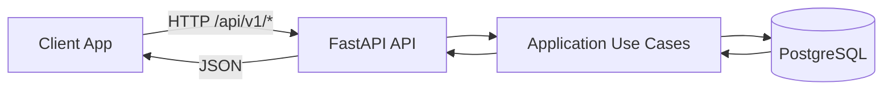

# Demo Carwash Backend API

This project is a demo backend service designed to simulate and manage the core operations of a carwash business. It showcases a well-structured backend architecture that emphasizes scalability, maintainability, and clean separation of concerns.

## Key Capabilities

- RESTful API with versioned prefix (`/api/v1`)
- Authentication and role-based access control (admin/cashier)
- Ticket creation, listing, and void flow
- Transaction processing and listing
- User registration, listing, activation, and deactivation
- Service type creation, listing, activation, and deactivation
- Async PostgreSQL access with repository pattern
- Dockerized local environment

## Why This Project Matters

- Architecture focus: Applies Clean Architecture separation (domain, application, API, infrastructure).
- Backend design focus: Uses use-case based application layer and DTO-driven flows.
- Demo scope clarity: Focuses on core carwash backend workflows without external integrations.
- Engineering showcase: Demonstrates API design, role checks, validation, and persistence integration.

## Architecture Overview

### Core Services

- `api`: FastAPI HTTP service
- `db`: PostgreSQL database service

### Request Flow

1. Client sends request to API endpoints under `/api/v1`
2. API validates payload and authorization/role access
3. Use case executes business logic through repositories
4. API returns structured response payload

### High-Level Architecture

## Tech Stack

- Python 3.12
- FastAPI
- PostgreSQL
- SQLAlchemy + asyncpg
- Pydantic v2
- slowapi (rate limiting)
- pytest
- Docker + Docker Compose

## Engineering Highlights

- Clean Architecture-inspired structure
- Use-case driven application layer
- Structured API response wrapper
- Security middleware (headers, CORS, rate limiting)
- Containerized local setup with database healthcheck

## Features Readiness Snapshot

- [x] Dockerized service setup
- [x] Database health check on compose startup
- [x] Auth and role-based endpoint protection
- [x] Basic API rate limiting

## Not Covered Implementation in Demo

- IoT device integration
- Loyalty, promotion, or membership system
- Payment gateway integration
- Multi-tenant support
- Monitoring and observability

## What This Repository Demonstrates

- Domain modeling with value objects and entities
- Use-case oriented backend architecture
- Separation of concerns across layers
- Practical API workflow for carwash operations
- Atomic Transaction
