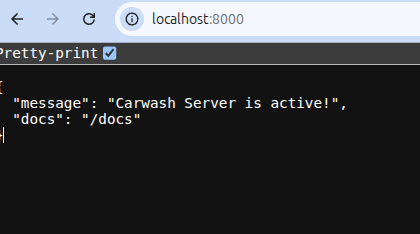

# Demo Carwash Backend API

This repository contains a **demo backend API** for a Carwash Management System.
The purpose of this project is to showcase **backend architecture, domain modeling,
and use-case driven design**, not a full production system.

This backend is designed as the core service for cashier applications and admin dashboards.

---

## Scope

This is a **demo version**.

Included:

- Core domain entities and value objects
- Use case–based application layer
- Ticket and transaction flow (simplified)
- User and service type management
- Async PostgreSQL repositories
- Dockerized local environment

Not included:

- IoT device integration
- Loyalty, promotion, or membership system
- Payment gateway integration
- Multi-tenant support
- Production monitoring and observability

---

## Architecture

The project follows **Clean Architecture** principles.

- **Domain**  
  Business entities, value objects, repository interfaces

- **Application**  
  Use cases (one use case per business action), Unit of Work, DTOs

- **API**  
  FastAPI routers, request/response schemas, dependency injection

- **Infrastructure**  
  PostgreSQL access via asyncpg, repository implementations

---

## Implemented Use Cases

### Auth

- Login (basic authentication flow)

### Service Type

- Create service type
- Update service data
- List service types
- Activate or deactivate service

### Ticket

- Create ticket
- List tickets
- Void ticket

### Transaction

- Process transaction
- List transactions

### User

- Register user
- List users
- Activate or deactivate user

---

## Tech Stack

- Python 3.12
- FastAPI
- PostgreSQL
- asyncpg
- Pydantic v2
- pytest
- Docker

---

## Configuration

Example environment file (`.env.docker`):

```env
DB_NAME=demo_carwash
DB_USER=app
DB_PASSWORD=apppass
DB_HOST=db
DB_PORT=5432

SECRET_KEY=change-me

HOST=0.0.0.0
PORT=8000
```

## Quick Start

The project is fully containerized.

To run the application locally:

```bash
git clone <repository-url>
cd demo-carwash-backend
docker compose up -d
```

API base URL:
http://localhost:8000

API documentation (Swagger UI):
http://localhost:8000/docs

### API Documentation Preview

**Running server:**



**Swagger UI:**


