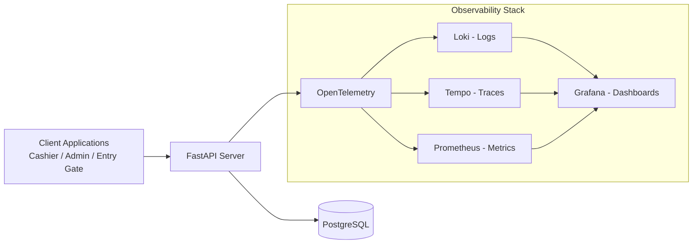
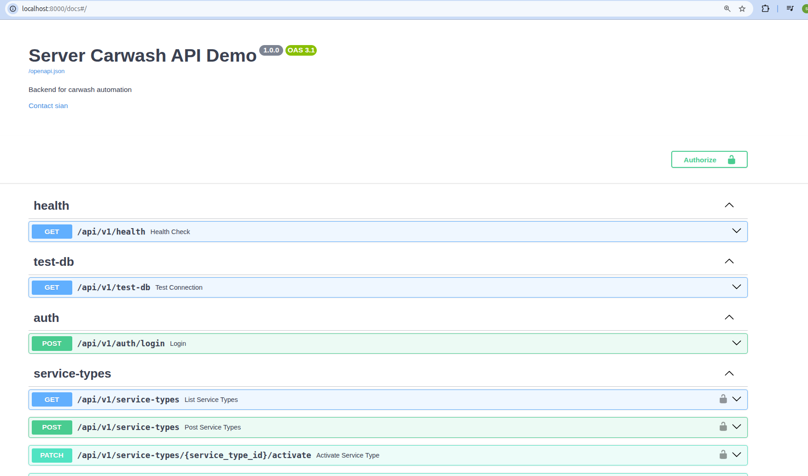
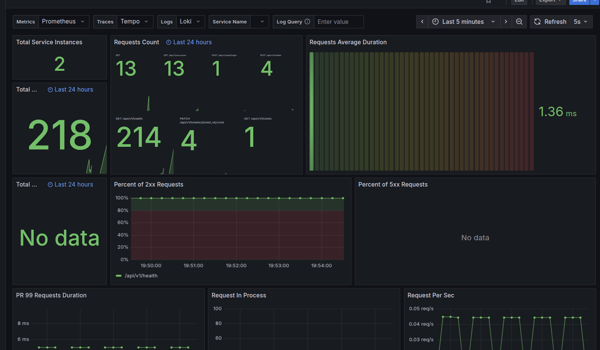

# Carwash Operations Backend API

<p align="left">
  
  
  
  
  
  
  
  
  
  
  
    
</p>

## System Overview

A FastAPI backend for managing carwash operations, including ticketing, cashier workflows, and daily reporting.

The system is built with modular clean architecture and includes JWT authentication, idempotency protection, and rate limiting to support reliable and maintainable operations.

Below is the High-level of the architecture:


Based on the architecture above, the system consists of three main subsystems: Entry Gate, Local Server, and Cashier.

The **Entry Gate** creates a ticket when a customer arrives to wash their car. The ticket data is then sent to the **Local Server**, which is located in the admin room and acts as the central backend service for connected clients such as the entry gate and cashier application.

The **Cashier** subsystem handles customer payments, ticket validation, and ticket void operations.


## Feature Scope

| Feature | Endpoint Scope | Business Value |
|---|---|---|
| Auth and session | `/api/v1/auth/*` | Secures access, supports login/refresh/logout lifecycle, and keeps cashier/operator sessions controlled. |
| Account management | `/api/v1/accounts/*` | Lets management onboard staff, assign roles, and control active/inactive users for operational governance. |
| Service type management | `/api/v1/service-types/*` | Keeps service catalog and pricing configurable so branch operations can adapt offerings without code changes. |
| Ticket operations | `/api/v1/tickets/*` | Standardizes car intake and queue flow, and supports controlled ticket voiding for auditability. |
| Billing transactions | `/api/v1/transactions/*` | Records payments reliably with idempotency protection to prevent duplicate charges during retries or network issues. |
| Analytics reporting | `/api/v1/analytics/*` | Provides daily operational and revenue insights for owner-level decision making. |
| Health and DB smoke-check | health + DB utility routes | Enables fast operational checks for uptime and database connectivity during deployment and monitoring. |

## Architecture



Project layout follows modular clean architecture under `app/modules/*`.

- `api`: routes, schemas, dependencies
- `application`: use cases, DTOs, ports, query models
- `domain`: entities, value objects, repository interfaces
- `infra`: repository implementations, adapters, unit-of-work

Shared concerns are in `app/shared/*`:

- configuration
- middleware
- database lifecycle
- exception handling
- logging

## Directory Structure

```text
app/
  api/
  modules/
    analytics/
    billing/
    carwash_operation/
    identity/
    service_catalog/
  shared/

tests/
migrations/
docker/
```

## API Docs

- Swagger UI: `http://localhost:8000/docs`
- Base API path: `/api/v1`

Here is the Swagger UI screenshoot:




## Roles and Access

Current roles:

- `ADMIN`
- `OWNER`
- `CASHIER`

Authorization examples:

- Account management: `ADMIN`, `OWNER`
- Service catalog management: `ADMIN`, `OWNER`
- Ticket list/void operations: `ADMIN`, `OWNER`, `CASHIER`
- Payment processing: `CASHIER`
- Analytics: `OWNER`

## Technical Highlights

This project includes several backend engineering concerns commonly required in production systems:

### Device-Based Access Context

`POST /api/v1/tickets` is designed for barrier gate usage and does not use a regular role-based user context.

Instead, it uses `get_current_device` to validate the registered barrier gate device/session context.

Required headers:

- `X-Device-Code: <registered_barrier_gate_code>`
- `Idempotency-Key: <unique_key_per_request>`

Common device validation errors:

- Missing `X-Device-Code` -> `"Device code is required"`
- Unknown device code -> `"Device is not registered"`
- Inactive device -> `"Device is inactive"`

### Idempotency Protection

Critical write endpoints require an `Idempotency-Key` to prevent duplicate processing caused by retries, network issues, or repeated client requests.

Protected endpoints:

- `POST /api/v1/tickets`
- `POST /api/v1/transactions`

Example header:

```http
Idempotency-Key: txn-20260516-001
```

### Example: Create Ticket from Barrier Gate

```bash
curl -X POST http://localhost:8000/api/v1/tickets \
  -H "X-Device-Code: BARRIER-GATE-001" \
  -H "Content-Type: application/json" \
  -H "Idempotency-Key: ticket-20260516-001" \
  -d '{
    "service_type_id": 1
  }'
```

### Example: Process Transaction

```bash
curl -X POST http://localhost:8000/api/v1/transactions \
  -H "Authorization: Bearer <access_token>" \
  -H "Content-Type: application/json" \
  -H "Idempotency-Key: txn-20260516-001" \
  -d '{
    "ticket_id": 1,
    "plate_number": "B 1234 XYZ",
    "payment_method": "cash",
    "payment_metadata": {}
  }'
```

### Login

```bash
curl -X POST http://localhost:8000/api/v1/auth/login \
  -H "Content-Type: application/json" \
  -d '{
    "username": "cashier_01",
    "password": "secret123"
  }'
```

### Create Ticket (Idempotent)

```bash
curl -X POST http://localhost:8000/api/v1/tickets \
  -H "X-Device-Code: BARRIER-GATE-001" \
  -H "Content-Type: application/json" \
  -H "Idempotency-Key: ticket-20260516-001" \
  -d '{
    "service_type_id": 1
  }'
```

### Process Transaction (Idempotent)

```bash
curl -X POST http://localhost:8000/api/v1/transactions \
  -H "Authorization: Bearer <access_token>" \
  -H "Content-Type: application/json" \
  -H "Idempotency-Key: txn-20260516-001" \
  -d '{
    "ticket_id": 1,
    "plate_number": "B 1234 XYZ",
    "payment_method": "cash",
    "payment_metadata": {}
  }'
```


## Active Rate Limits

- `GET /api/v1/health` -> `5/minute`
- `GET /api/v1/test-db` -> `10/minute`
- `POST /api/v1/auth/login` -> `10/minute`
- `POST /api/v1/auth/refresh` -> `20/minute`
- `POST /api/v1/auth/logout` -> `20/minute`
- `POST /api/v1/accounts` -> `10/minute`
- `POST /api/v1/service-types` -> `10/minute`
- `PATCH /api/v1/service-types/{service_type_id}` -> `20/minute`
- `DELETE /api/v1/service-types/{service_type_id}` -> `10/minute`
- `POST /api/v1/tickets` -> `30/minute`
- `PATCH /api/v1/tickets/{ticket_id}/void` -> `20/minute`
- `POST /api/v1/transactions` -> `20/minute`

## Getting the Code

```bash
git clone https://github.com/siantika/be-carwash-demo.git
cd demo-carwash-api
```

## Local Development

### Prerequisites

- Python 3.12+
- Docker + Docker Compose

### Option A: Full Docker (recommended)

1. Prepare Docker env file.

```bash
cp .env.docker.example .env.docker
```

2. Set your DB password in `.env.docker`:

- `DB_PASSWORD`
- `ALEMBIC_DATABASE_URL` (must use the same password)

3. Start all services.

```bash
docker compose up --build -d
```

Docker flow:
- `db`: PostgreSQL
- `migrate`: initialize/update schema from `docker/schema.sql` (idempotent guard)
- `seed`: insert/update demo accounts, devices, and service types
- `api`: starts after schema + seed completed

4. Verify:

- Swagger UI: `http://localhost:8000/docs`
- Health: `curl http://localhost:8000/api/v1/health`

Observability endpoints:
- Grafana: `http://localhost:3000` (user/pass: `admin` / `admin`)
- Prometheus: `http://localhost:9090`
- Loki: `http://localhost:3100`
- Tempo: `http://localhost:3200`
- OTEL Collector OTLP HTTP: `http://localhost:4318`

Pre-provisioned Grafana dashboard:
- Folder: `Carwash`
- Dashboard: `Carwash API Observability`

Here is the screenshoot of the Grafana Dashboard




Generate sample traffic/logs:
```bash
curl http://localhost:8000/api/v1/health
curl http://localhost:8000/api/v1/test-db
```

### Option B: Hybrid Local (API local + DB in Docker)

```bash
python3 -m venv .venv
source .venv/bin/activate
pip install -r requirements.txt
cp .env.local.example .env
```

Update `.env` with required values:

- `DB_NAME`
- `DB_USER`
- `DB_PASSWORD`
- `DB_HOST`
- `DB_PORT`
- `ALEMBIC_DATABASE_URL`
- `SECRET_KEY`
- `HOST`
- `PORT`
- `API_VERSION=/api/v1`

Start DB, migrate, seed, then run API:

```bash
docker compose up -d db
alembic upgrade head
make seed
python3 -m app.main
```

Verify:

- Swagger UI: `http://localhost:8000/docs`
- Health: `curl http://localhost:8000/api/v1/health`

## Database Migration (Alembic)

Make sure `ALEMBIC_DATABASE_URL` is set in `.env`.

Apply all migrations:

```bash
alembic upgrade head
```

Create a new migration:

```bash
alembic revision -m "your_migration_message"
```

Rollback one migration:

```bash
alembic downgrade -1
```

Check current migration version:

```bash
alembic current
```

## Quality Commands

```bash
make format
make format-check
make lint
make test
```

## Notes

- Alembic migrations are the source of truth for schema changes.
- Built-in seed command is available via `make seed`.
