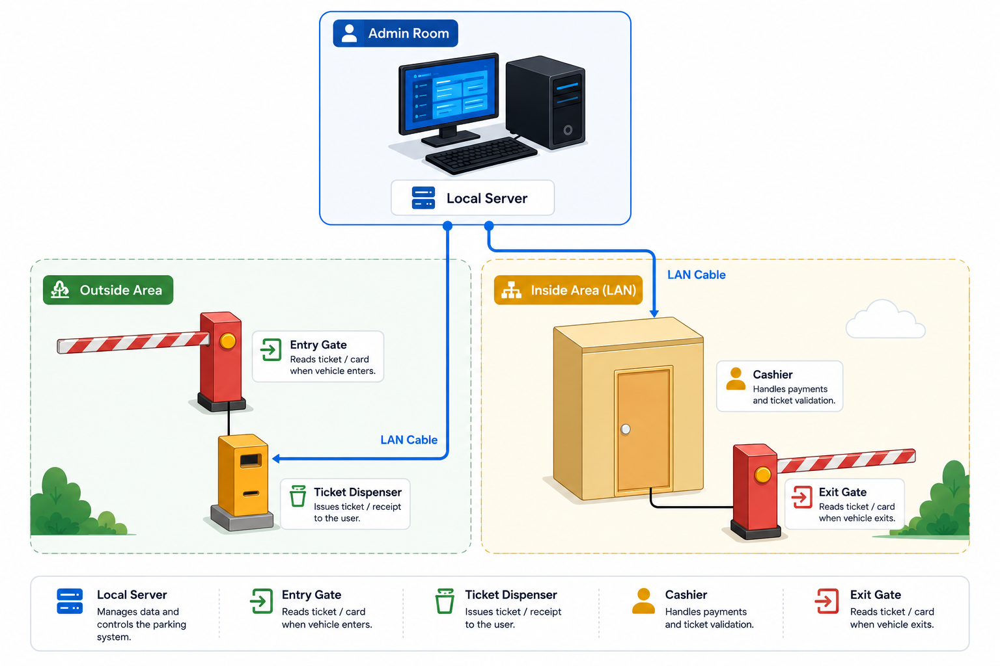

# Demo Carwash Backend API

FastAPI backend for carwash operations, built with modular clean architecture, JWT authentication, idempotency protection, and rate limiting.

## System Overview

Carwash operations are often handled manually across ticketing, cashier flow, and reporting. This API centralizes those workflows into a structured backend service.

High-level architecture:



## Feature Scope

| Feature | Endpoint Scope | Business Value |
|---|---|---|
| Auth and session | `/api/v1/auth/*` | Secures access, supports login/refresh/logout lifecycle, and keeps cashier/operator sessions controlled. |
| Account management | `/api/v1/accounts/*` | Lets management onboard staff, assign roles, and control active/inactive users for operational governance. |
| Service type management | `/api/v1/service-types/*` | Keeps service catalog and pricing configurable so branch operations can adapt offerings without code changes. |
| Ticket operations | `/api/v1/tickets/*` | Standardizes car intake and queue flow, and supports controlled ticket voiding for auditability. |
| Billing transactions | `/api/v1/transactions/*` | Records payments reliably with idempotency protection to prevent duplicate charges during retries or network issues. |
| Analytics reporting | `/api/v1/analytics/*` | Provides daily operational and revenue insights for owner-level decision making. |
| Health and DB smoke-check | health + DB utility routes | Enables fast operational checks for uptime and database connectivity during deployment and monitoring. |

## Tech Stack

<p align="left">
  
  
  
  
  
  
  
  
  
  
  
</p>

## Architecture

Project layout follows modular clean architecture under `app/modules/*`.

- `api`: routes, schemas, dependencies
- `application`: use cases, DTOs, ports, query models
- `domain`: entities, value objects, repository interfaces
- `infra`: repository implementations, adapters, unit-of-work

Shared concerns are in `app/shared/*`:

- configuration
- middleware
- database lifecycle
- exception handling
- logging

## Directory Structure

```text
app/
  api/
  modules/
    analytics/
    billing/
    carwash_operation/
    identity/
    service_catalog/
  shared/

tests/
migrations/
docker/
```


## API Docs

- Swagger UI: `http://localhost:8000/docs`
- Base API path: `/api/v1`

## Roles and Access

Current roles:

- `ADMIN`
- `OWNER`
- `CASHIER`

Authorization examples:

- Account management: `ADMIN`, `OWNER`
- Service catalog management: `ADMIN`, `OWNER`
- Ticket list/void operations: `ADMIN`, `OWNER`, `CASHIER`
- Payment processing: `CASHIER`
- Analytics: `OWNER`

Important note:

- `POST /api/v1/tickets` uses `get_current_device` (barrier gate device/session context), not `RoleChecker`.
- It requires both `X-Device-Code` and `Idempotency-Key` headers.

## Authentication Flow

1. `POST /api/v1/auth/login` -> returns `access_token` + `refresh_token`
2. Use `Authorization: Bearer <access_token>` for protected routes
3. `POST /api/v1/auth/refresh` -> rotates token pair
4. `POST /api/v1/auth/logout` -> revokes refresh token
5. `GET /api/v1/auth/me` -> returns active user context

Default token settings:

- `ALGORITHM=HS256`
- `ACCESS_TOKEN_EXPIRE_HOURS=8`
- `REFRESH_TOKEN_EXPIRE_DAYS=7`

## Endpoint Summary

### Health

- `GET /api/v1/health`
- `GET /api/v1/test-db`

### Auth

- `POST /api/v1/auth/login`
- `POST /api/v1/auth/refresh`
- `POST /api/v1/auth/logout`
- `GET /api/v1/auth/me`

### Accounts

- `POST /api/v1/accounts`
- `GET /api/v1/accounts`
- `GET /api/v1/accounts/{account_id}`
- `PATCH /api/v1/accounts/{account_id}/activate`
- `PATCH /api/v1/accounts/{account_id}/deactivate`
- `DELETE /api/v1/accounts/{account_id}`

### Service Types

- `POST /api/v1/service-types`
- `GET /api/v1/service-types`
- `GET /api/v1/service-types/name/{service_name}`
- `GET /api/v1/service-types/{service_type_id}`
- `PATCH /api/v1/service-types/{service_type_id}`
- `PATCH /api/v1/service-types/{service_type_id}/activate`
- `PATCH /api/v1/service-types/{service_type_id}/deactivate`
- `DELETE /api/v1/service-types/{service_type_id}`

### Tickets

- `POST /api/v1/tickets`
- `GET /api/v1/tickets`
- `PATCH /api/v1/tickets/{ticket_id}/void`

### Transactions

- `POST /api/v1/transactions`
- `GET /api/v1/transactions`

### Analytics

- `GET /api/v1/analytics/dashboard-summary`
- `GET /api/v1/analytics/daily-revenue`
- `GET /api/v1/analytics/top-services`
- `GET /api/v1/analytics/payment-method-summary`

## Idempotency

Critical write endpoints require `Idempotency-Key`:

- `POST /api/v1/tickets`
- `POST /api/v1/transactions`

Example header:

```http
Idempotency-Key: txn-20260516-001
```

## Create Ticket with Barrier Gate Context

`POST /api/v1/tickets` is validated by barrier gate device context.

Required headers:

- `Authorization: Bearer <access_token>`
- `X-Device-Code: <registered_barrier_gate_code>`
- `Idempotency-Key: <unique_key_per_request>`

Request body:

```json
{
  "service_type_id": 1
}
```

Common barrier-gate validation errors:

- Missing `X-Device-Code` -> `"Device code is required"`
- Unknown device code -> `"Device is not registered"`
- Inactive device -> `"Device is inactive"`

## Example Requests

### Login

```bash
curl -X POST http://localhost:8000/api/v1/auth/login \
  -H "Content-Type: application/json" \
  -d '{
    "username": "cashier_01",
    "password": "secret123"
  }'
```

### Create Ticket (Idempotent)

```bash
curl -X POST http://localhost:8000/api/v1/tickets \
  -H "Authorization: Bearer <access_token>" \
  -H "X-Device-Code: BARRIER-GATE-001" \
  -H "Content-Type: application/json" \
  -H "Idempotency-Key: ticket-20260516-001" \
  -d '{
    "service_type_id": 1
  }'
```

### Process Transaction (Idempotent)

```bash
curl -X POST http://localhost:8000/api/v1/transactions \
  -H "Authorization: Bearer <access_token>" \
  -H "Content-Type: application/json" \
  -H "Idempotency-Key: txn-20260516-001" \
  -d '{
    "ticket_id": 1,
    "plate_number": "B 1234 XYZ",
    "payment_method": "cash",
    "payment_metadata": {}
  }'
```

## Environment Variables

Start from `.env.local.example`, then configure `.env`.

Required/common runtime variables:

- `DB_NAME`
- `DB_USER`
- `DB_PASSWORD`
- `DB_HOST`
- `DB_PORT`
- `ALEMBIC_DATABASE_URL`
- `SECRET_KEY`
- `HOST`
- `PORT`
- `API_VERSION` (example: `/api/v1`)

Optional variables (default in `settings.py`):

- `ALGORITHM` (default `HS256`)
- `ACCESS_TOKEN_EXPIRE_HOURS` (default `8`)
- `REFRESH_TOKEN_EXPIRE_DAYS` (default `7`)
- `CORS_ORIGINS` (default `[*]`)
- `CORS_ALLOW_METHODS` (default `GET,POST,PUT,PATCH,OPTIONS`)
- `CORS_ALLOW_HEADERS` (default `Authorization,Content-Type,Accept`)

## Active Rate Limits

- `GET /api/v1/health` -> `5/minute`
- `GET /api/v1/test-db` -> `10/minute`
- `POST /api/v1/auth/login` -> `10/minute`
- `POST /api/v1/auth/refresh` -> `20/minute`
- `POST /api/v1/auth/logout` -> `20/minute`
- `POST /api/v1/accounts` -> `10/minute`
- `POST /api/v1/service-types` -> `10/minute`
- `PATCH /api/v1/service-types/{service_type_id}` -> `20/minute`
- `DELETE /api/v1/service-types/{service_type_id}` -> `10/minute`
- `POST /api/v1/tickets` -> `30/minute`
- `PATCH /api/v1/tickets/{ticket_id}/void` -> `20/minute`
- `POST /api/v1/transactions` -> `20/minute`

## Local Development

### Prerequisites

- Python 3.12+
- Docker + Docker Compose

## Quickstart (Local Deployment)

Follow this sequence from a fresh setup until the API is working.

1. Clone project and enter directory.

```bash
git clone <your-repo-url>
cd demo-carwash-api
```

2. Create virtual environment and install dependencies.

```bash
python3 -m venv .venv
source .venv/bin/activate
pip install -r requirements.txt
```

3. Create local environment file.

```bash
cp .env.local.example .env
```

4. Edit `.env` with your local values (minimum required):

- `DB_NAME`
- `DB_USER`
- `DB_PASSWORD`
- `DB_HOST`
- `DB_PORT`
- `ALEMBIC_DATABASE_URL`
- `SECRET_KEY`
- `HOST`
- `PORT`
- `API_VERSION=/api/v1`

5. Start PostgreSQL (recommended via Docker).

```bash
docker compose up -d db
```

6. Run database migrations.

```bash
alembic upgrade head
```

7. Seed demo data (accounts, barrier gates, service types).

```bash
make seed
```

8. Start API server.

```bash
python3 -m app.main
```

9. Verify service.

- Open: `http://localhost:8000/docs`
- Health check:

```bash
curl http://localhost:8000/api/v1/health
```

10. Login using seeded cashier account.

```bash
curl -X POST http://localhost:8000/api/v1/auth/login \
  -H "Content-Type: application/json" \
  -d '{"username":"cashier_demo","password":"Cashier123!"}'
```

11. Create ticket with barrier gate context.

```bash
curl -X POST http://localhost:8000/api/v1/tickets \
  -H "Authorization: Bearer <access_token>" \
  -H "X-Device-Code: BARRIER-GATE-001" \
  -H "Idempotency-Key: ticket-local-001" \
  -H "Content-Type: application/json" \
  -d '{"service_type_id":1}'
```

### Run with Docker

```bash
docker compose up --build
```

### Run without Docker

```bash
python3 -m venv .venv
source .venv/bin/activate
pip install -r requirements.txt
cp .env.local.example .env
python3 -m app.main
```

Seed demo data (accounts, barrier gates, service types):

```bash
make seed
```

## Database Migration (Alembic)

Make sure `ALEMBIC_DATABASE_URL` is set in `.env`.

Apply all migrations:

```bash
alembic upgrade head
```

Create a new migration:

```bash
alembic revision -m "your_migration_message"
```

Rollback one migration:

```bash
alembic downgrade -1
```

Check current migration version:

```bash
alembic current
```

## Quality Commands

```bash
make format
make format-check
make lint
make test
```

## Notes

- Alembic migrations are the source of truth for schema changes.
- Built-in seed command is available via `make seed`.
